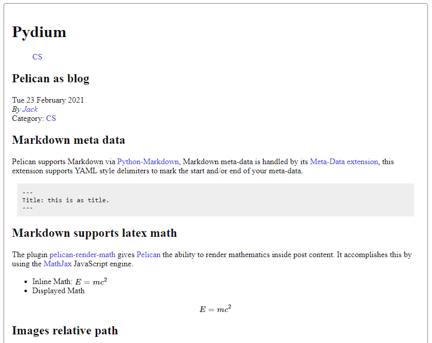

# Pelican Theme for Blog
Fork from Pelican built in `simple` theme.

## Features
- Concise and Light.
- Support Latex math.
- Built in [utterances](https://utteranc.es) comment system.

## Configuration
```python
# publishconf.py
UTTERANCES_REPONAME = "<repo name>"
```

